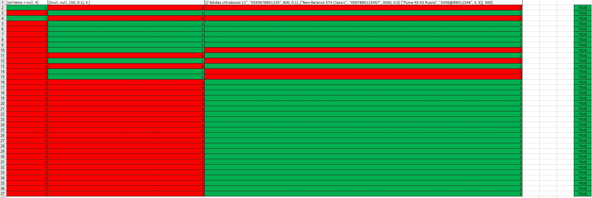
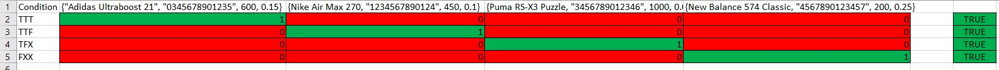

Далибор Блажевски 204005

**Control Flow Graph**

Цикломатската комплексност -  10

1. Број на предикати = 9 + 1 = 10

2. Според формулата за пресметка на цикломатска комплексност

E - N + 2

Број на ребра(E) = 36
Број на јазли(N) = 28

E - N + 2 = 36 - 28 + 2 = 10

**Тест случаи според критериумот Every branch**

За every branch условот, потребни се 3 тест случаја:

* [allItems = null, X]
* 
* [{null, null, 150, 0.1}, X ]
* 
* [{"Adidas Ultraboost 21", "0345678901235", 600, 0.1} 

**Тест случаи според критериумот Multiple Conditions**

За Multiple Condtions потребни се 4 теста:

* {"Adidas Ultraboost 21", "0345678901235", 600, 0.15}

* {Nike Air Max 270, "1234567890124", 450, 0.1}

* {Puma RS-X3 Puzzle, "3456789012346", 1000, 0.0}

* {New Balance 574 Classic, "4567890123457", 200, 0.25}

Тест случаите се добиени според можните начини на решавање X and Y and Z

* True True True
* True True False
* True False X
* False X X

* Објаснувања на Unit tests

Unit тестовите се добиени од претходните 2 барања и се поделени во 2 метода:

* everyBranch()
* multipleCondition()

